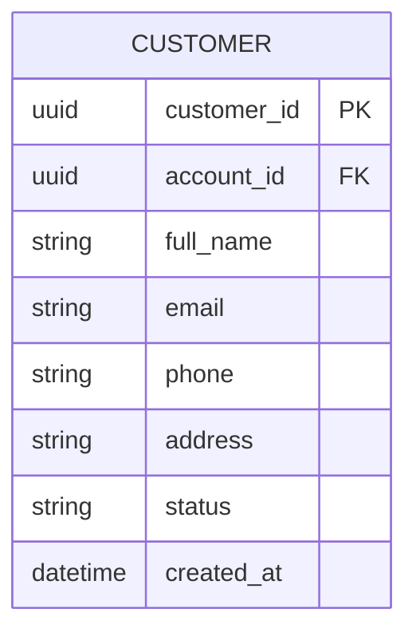
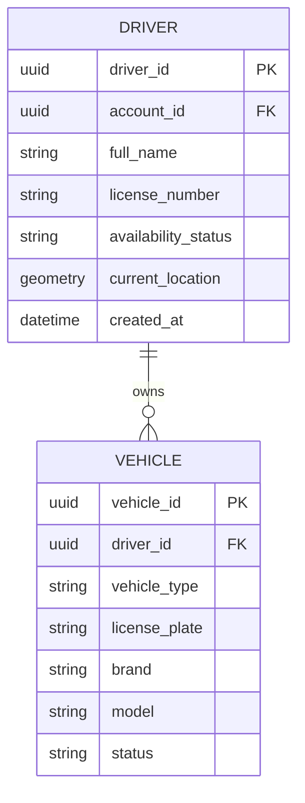
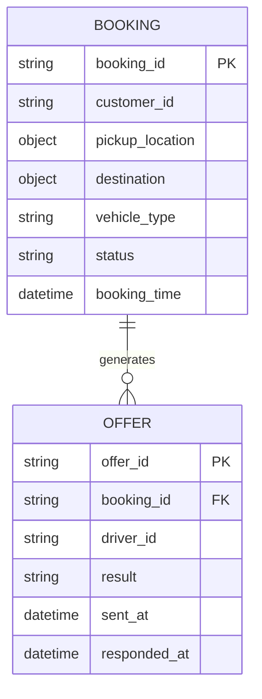
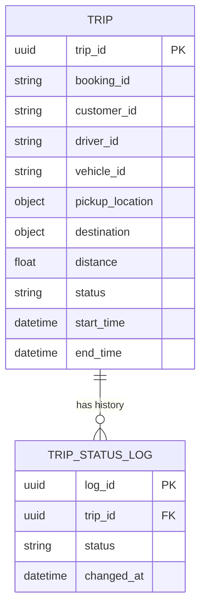
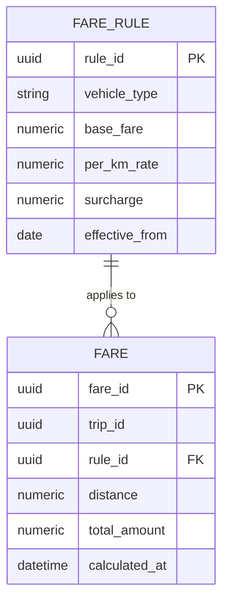
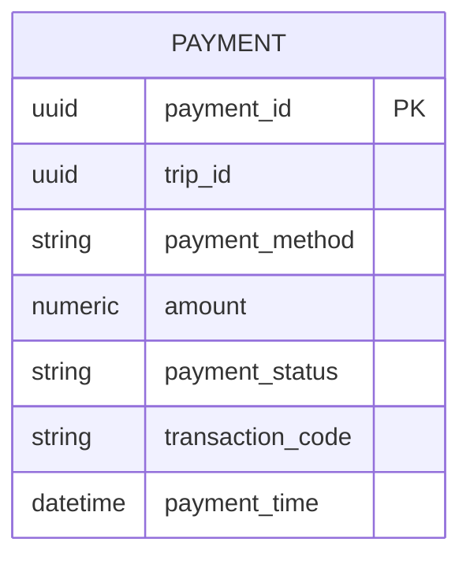
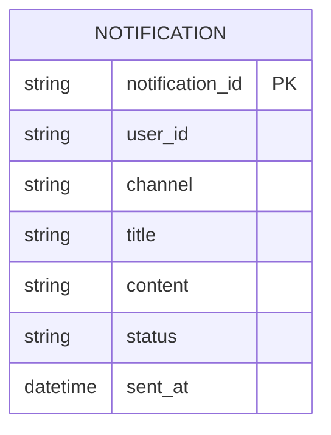
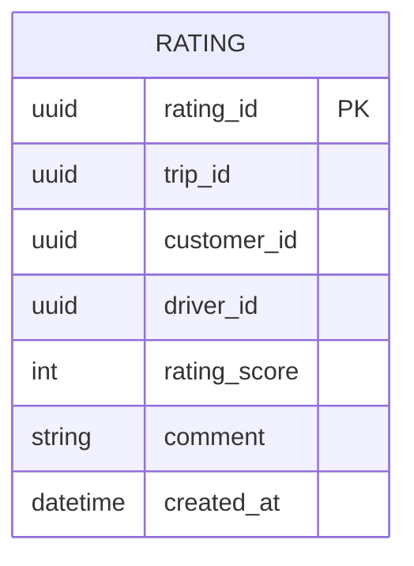
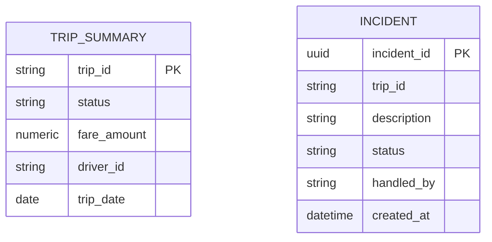
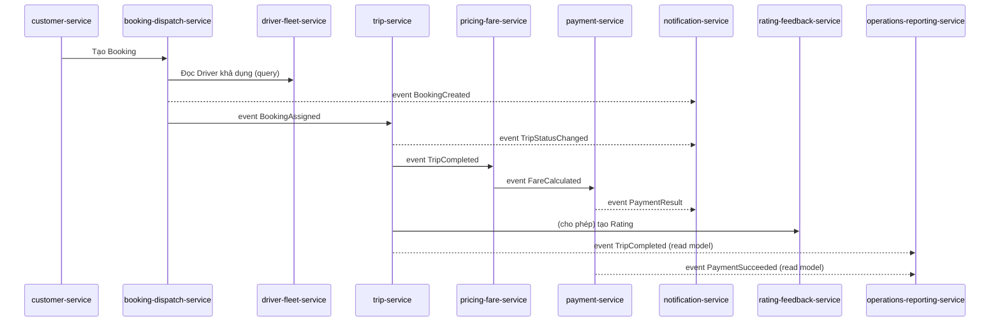

# THIẾT KẾ MICROSERVICES THEO BOUNDED CONTEXT — CAB SYSTEM

## 0. Bảng tổng quan Microservice ↔ Database

| # | Microservice | Bounded Context | Loại CSDL | Lý do chọn (tóm tắt) |
|---|---|---|---|---|
| 1 | `iam-service` | Identity & Access | **PostgreSQL** (Relational) | Cần ACID, quan hệ Account–Role–Permission chặt chẽ |
| 2 | `customer-service` | Customer | **PostgreSQL** (Relational) | Dữ liệu hồ sơ có cấu trúc cố định, cần toàn vẹn |
| 3 | `driver-fleet-service` | Driver & Fleet | **PostgreSQL + PostGIS** (Relational + Geospatial) | Cần truy vấn khoảng cách/vị trí hiệu quả (geospatial index) |
| 4 | `booking-dispatch-service` | Booking & Dispatch | **MongoDB** (Document) + **Redis** (cache trạng thái realtime) | Dữ liệu Offer/Candidate thay đổi liên tục, cấu trúc lồng nhau, cần ghi/đọc rất nhanh |
| 5 | `trip-service` | Trip Execution | **PostgreSQL** (Relational) | Trạng thái tuần tự chặt chẽ, cần transaction, timeline chuẩn hoá |
| 6 | `pricing-fare-service` | Pricing & Fare | **PostgreSQL** (Relational) | Số liệu tiền tệ chính xác, quy tắc Fare Rule có version, cần join |
| 7 | `payment-service` | Payment | **PostgreSQL** (Relational) | Dữ liệu tài chính bắt buộc ACID, audit chặt |
| 8 | `notification-service` | Notification | **MongoDB** (Document) | Payload đa dạng theo từng Channel, khối lượng lớn, TTL tự xoá |
| 9 | `rating-feedback-service` | Rating & Feedback | **PostgreSQL** (Relational) | Dữ liệu nhỏ, có cấu trúc, cần ràng buộc 1 Trip - 1 Rating |
| 10 | `operations-reporting-service` | Operations & Reporting | **Elasticsearch** (Search/Analytics) | Read model tổng hợp, cần aggregation & tìm kiếm nhanh trên dữ liệu lớn |

---

## 1. `iam-service` — Identity & Access Context

### 1.1. FR liên quan & Workflow phục vụ
- **FR13, FR17, FR18** (SRS B7)
- Phục vụ workflow: **BR12 – Quy trình bảo mật và phân quyền** (B6.12), là bước tiền đề của mọi workflow khác (B6.1, B6.4, B6.10...).

### 1.2. Ubiquitous Language

| Thuật ngữ | Định nghĩa |
|---|---|
| Account | Danh tính đăng nhập (không phải hồ sơ nghiệp vụ) |
| Role | `Customer`, `Driver`, `OperationStaff`, `Administrator` |
| Permission | Quyền hành động cụ thể gắn Role |
| Authentication / Authorization | Xác minh danh tính / Kiểm tra quyền |
| Audit Trail | Log thao tác quan trọng |

### 1.3. Mô hình thực thể

```mermaid
CREATE TABLE roles (
    role_id UUID PRIMARY KEY,
    role_name VARCHAR(30) UNIQUE NOT NULL
);

CREATE TABLE accounts (
    account_id UUID PRIMARY KEY,
    email VARCHAR(150) UNIQUE,
    phone VARCHAR(20) UNIQUE,
    password_hash VARCHAR(255) NOT NULL,
    role_id UUID REFERENCES roles(role_id),
    status VARCHAR(20) DEFAULT 'ACTIVE',
    created_at TIMESTAMP DEFAULT now()
);

CREATE TABLE permissions (
    permission_id UUID PRIMARY KEY,
    role_id UUID REFERENCES roles(role_id),
    action_code VARCHAR(50) NOT NULL
);

CREATE TABLE audit_logs (
    log_id UUID PRIMARY KEY,
    account_id UUID REFERENCES accounts(account_id),
    action VARCHAR(100),
    description TEXT,
    ip_address VARCHAR(45),
    created_at TIMESTAMP DEFAULT now()
);
```

### 1.4. API (REST)

| Method | Endpoint | Mô tả |
|---|---|---|
| POST | `/api/accounts/register` | Đăng ký tài khoản |
| POST | `/api/accounts/login` | Đăng nhập, trả về JWT |
| POST | `/api/accounts/verify-token` | Xác thực token (internal, cho service khác gọi) |
| GET | `/api/accounts/{id}/permissions` | Lấy danh sách quyền |
| PUT | `/api/accounts/{id}/role` | Đổi vai trò (Admin only) |
| GET | `/api/audit-logs?accountId=` | Tra cứu log thao tác |

### 1.5. Chọn loại CSDL: **PostgreSQL**
- Quan hệ Account–Role–Permission là quan hệ chặt (1-N, N-N), cần **JOIN** và ràng buộc khoá ngoại.
- Bảo mật/ACID bắt buộc: không được mất/nhân đôi dữ liệu đăng nhập.
- Khối lượng dữ liệu không quá lớn, không cần scale ngang mạnh như Booking.

### 1.6. Database Schema (PostgreSQL)

```sql
CREATE TABLE roles (
    role_id UUID PRIMARY KEY,
    role_name VARCHAR(30) UNIQUE NOT NULL
);

CREATE TABLE accounts (
    account_id UUID PRIMARY KEY,
    email VARCHAR(150) UNIQUE,
    phone VARCHAR(20) UNIQUE,
    password_hash VARCHAR(255) NOT NULL,
    role_id UUID REFERENCES roles(role_id),
    status VARCHAR(20) DEFAULT 'ACTIVE',
    created_at TIMESTAMP DEFAULT now()
);

CREATE TABLE permissions (
    permission_id UUID PRIMARY KEY,
    role_id UUID REFERENCES roles(role_id),
    action_code VARCHAR(50) NOT NULL
);

CREATE TABLE audit_logs (
    log_id UUID PRIMARY KEY,
    account_id UUID REFERENCES accounts(account_id),
    action VARCHAR(100),
    description TEXT,
    ip_address VARCHAR(45),
    created_at TIMESTAMP DEFAULT now()
);
```

---

## 2. `customer-service` — Customer Context

### 2.1. FR liên quan & Workflow
- **FR01** (phần khách hàng)
- Phục vụ: **UC03 – Quản lý thông tin cá nhân**, là bước đầu của workflow B6.1.

### 2.2. Ubiquitous Language

| Thuật ngữ | Định nghĩa |
|---|---|
| Customer | Hồ sơ nghiệp vụ khách hàng (khác Account) |
| Status | `Active`, `Inactive`, `Suspended` |
| Profile | Thông tin chỉnh sửa được |

### 2.3. Mô hình thực thể



### 2.4. API

| Method | Endpoint | Mô tả |
|---|---|---|
| POST | `/api/customers` | Tạo hồ sơ khách hàng (sau khi IAM tạo Account) |
| GET | `/api/customers/{id}` | Xem thông tin |
| PUT | `/api/customers/{id}` | Cập nhật hồ sơ |
| PUT | `/api/customers/{id}/status` | Đổi trạng thái (Suspend...) |

### 2.5. Chọn loại CSDL: **PostgreSQL**
- Dữ liệu có schema cố định, ít thay đổi cấu trúc.
- Cần ràng buộc unique (email, phone), truy vấn đơn giản theo ID.

### 2.6. Database Schema

```sql
CREATE TABLE customers (
    customer_id UUID PRIMARY KEY,
    account_id UUID NOT NULL, -- tham chiếu logic tới iam-service
    full_name VARCHAR(150),
    email VARCHAR(150) UNIQUE,
    phone VARCHAR(20) UNIQUE,
    address TEXT,
    status VARCHAR(20) DEFAULT 'ACTIVE',
    created_at TIMESTAMP DEFAULT now()
);
```

---

## 3. `driver-fleet-service` — Driver & Fleet Context

### 3.1. FR liên quan & Workflow
- **BR04, FR08**
- Phục vụ: **B6.4 – Quy trình quản lý tài xế**, **UC07, UC15, UC16**.

### 3.2. Ubiquitous Language

| Thuật ngữ | Định nghĩa |
|---|---|
| Driver | Hồ sơ nghiệp vụ tài xế |
| AvailabilityStatus | `Available`, `Busy`, `Offline` |
| CurrentLocation | Toạ độ realtime |
| Vehicle | Phương tiện gắn 1 Driver |

### 3.3. Mô hình thực thể



### 3.4. API

| Method | Endpoint | Mô tả |
|---|---|---|
| POST | `/api/drivers` | Tạo hồ sơ tài xế |
| PUT | `/api/drivers/{id}/status` | Cập nhật AvailabilityStatus |
| PUT | `/api/drivers/{id}/location` | Cập nhật vị trí realtime |
| GET | `/api/drivers/nearby?lat=&lng=&radius=` | Tìm tài xế gần (dùng cho Booking Context) |
| POST | `/api/drivers/{id}/vehicles` | Thêm phương tiện |

### 3.5. Chọn loại CSDL: **PostgreSQL + PostGIS**
- Cần truy vấn **geospatial** (tìm tài xế trong bán kính X km) — PostGIS cung cấp index không gian (`GIST`) hiệu quả.
- Vẫn cần quan hệ Driver–Vehicle chặt (1-N), phù hợp relational.
- *Lưu ý:* vị trí realtime tần suất cao có thể đệm thêm ở Redis (cache), nhưng **nguồn dữ liệu chính thức (system of record)** vẫn là PostgreSQL/PostGIS để đảm bảo 1 service - 1 database logic.

### 3.6. Database Schema

```sql
CREATE EXTENSION IF NOT EXISTS postgis;

CREATE TABLE drivers (
    driver_id UUID PRIMARY KEY,
    account_id UUID NOT NULL,
    full_name VARCHAR(150),
    license_number VARCHAR(50),
    availability_status VARCHAR(20) DEFAULT 'OFFLINE',
    current_location GEOGRAPHY(POINT, 4326),
    created_at TIMESTAMP DEFAULT now()
);
CREATE INDEX idx_driver_location ON drivers USING GIST(current_location);

CREATE TABLE vehicles (
    vehicle_id UUID PRIMARY KEY,
    driver_id UUID REFERENCES drivers(driver_id),
    vehicle_type VARCHAR(30),
    license_plate VARCHAR(20) UNIQUE,
    brand VARCHAR(50),
    model VARCHAR(50),
    status VARCHAR(20) DEFAULT 'PENDING'
);
```

---

## 4. `booking-dispatch-service` — Booking & Dispatch Context ⭐ (Core)

### 4.1. FR liên quan & Workflow
- **BR01, BR02, FR02, FR03, FR04, FR09, FR11**
- Phục vụ: **B6.1 – Đặt chuyến xe**, **B6.2 – Tìm và phân công tài xế** (2 workflow trọng tâm của toàn hệ thống).

### 4.2. Ubiquitous Language

| Thuật ngữ | Định nghĩa |
|---|---|
| Booking | Yêu cầu đặt xe trước khi có tài xế xác nhận |
| Dispatch | Quá trình gửi Offer tuần tự |
| Candidate Driver | Driver đang xét trong vòng match |
| Offer Timeout | Hạn phản hồi Driver |
| Assignment | Kết quả: Driver được gán |

### 4.3. Mô hình thực thể



### 4.4. API

| Method | Endpoint | Mô tả |
|---|---|---|
| POST | `/api/bookings` | Tạo yêu cầu đặt xe |
| GET | `/api/bookings/{id}` | Xem trạng thái booking |
| POST | `/api/bookings/{id}/offers/{driverId}/accept` | Tài xế chấp nhận |
| POST | `/api/bookings/{id}/offers/{driverId}/reject` | Tài xế từ chối |
| GET | `/api/bookings/{id}/candidates` | (internal) Danh sách candidate hiện tại |

### 4.5. Chọn loại CSDL: **MongoDB** (chính) + **Redis** (cache trạng thái/Offer Timeout)
- Cấu trúc `Booking` có mảng `Offer` lồng nhau, thay đổi linh hoạt theo từng vòng dispatch → **Document DB** phù hợp hơn Relational (tránh JOIN liên tục).
- Tần suất ghi/đọc rất cao trong thời gian ngắn (mỗi giây có thể có hàng trăm booking) → cần throughput cao, MongoDB đáp ứng tốt hơn RDBMS ở khối lượng ghi lớn, schema linh hoạt.
- Redis dùng làm **cache/queue tạm thời** cho việc đếm Offer Timeout (TTL key) — đây là tầng phụ trợ tốc độ cao, không phải "database chính" của service (source of truth vẫn là MongoDB).

### 4.6. Database Schema (MongoDB collection)

```json
// Collection: bookings
{
  "_id": "BK-2026-000123",
  "customerId": "CUS-001",
  "pickupLocation": { "lat": 10.776, "lng": 106.700 },
  "destination": { "lat": 10.800, "lng": 106.650 },
  "vehicleType": "4-seat",
  "status": "DISPATCHING",  // CREATED | DISPATCHING | ASSIGNED | NO_DRIVER_FOUND | CANCELLED
  "offers": [
    {
      "driverId": "DRV-045",
      "sentAt": "2026-09-23T08:00:00Z",
      "respondedAt": "2026-09-23T08:00:12Z",
      "result": "REJECTED"
    }
  ],
  "bookingTime": "2026-09-23T07:59:50Z"
}
```

---

## 5. `trip-service` — Trip Execution Context ⭐ (Core)

### 5.1. FR liên quan & Workflow
- **BR03, BR05, FR05, FR06**
- Phục vụ: **B6.3 – Theo dõi chuyến đi**, **B6.5 – Quản lý chuyến đi**.

### 5.2. Ubiquitous Language

| Thuật ngữ | Định nghĩa |
|---|---|
| Trip | Chuyến đi đã có Driver, vòng đời riêng biệt với Booking |
| TripStatus | `Assigned→Arriving→Arrived→PickedUp→InProgress→Completed`/`Cancelled` |
| Cancellation | Dừng Trip trước khi hoàn thành |
| ETA | Ước tính thời gian đến |

### 5.3. Mô hình thực thể



### 5.4. API

| Method | Endpoint | Mô tả |
|---|---|---|
| POST | `/api/trips` | Tạo Trip (nội bộ, nghe event `BookingAssigned`) |
| PUT | `/api/trips/{id}/status` | Cập nhật trạng thái (tuần tự) |
| GET | `/api/trips/{id}` | Xem chi tiết chuyến |
| GET | `/api/trips?customerId=` | Lịch sử chuyến của khách hàng |
| POST | `/api/trips/{id}/cancel` | Huỷ chuyến |

### 5.5. Chọn loại CSDL: **PostgreSQL**
- `TripStatus` phải chuyển **tuần tự, không nhảy cóc** → cần ràng buộc transaction/kiểm tra chặt, RDBMS xử lý tốt qua transaction + check constraint.
- Cần JOIN với TripStatusLog để trả lịch sử chuyến chính xác, đảm bảo ACID khi ghi đồng thời trạng thái + fare/timeline.

### 5.6. Database Schema

```sql
CREATE TABLE trips (
    trip_id UUID PRIMARY KEY,
    booking_id VARCHAR(50),
    customer_id UUID NOT NULL,
    driver_id UUID NOT NULL,
    vehicle_id UUID,
    pickup_location JSONB,
    destination JSONB,
    distance NUMERIC(8,2),
    status VARCHAR(20) DEFAULT 'ASSIGNED',
    start_time TIMESTAMP,
    end_time TIMESTAMP
);

CREATE TABLE trip_status_logs (
    log_id UUID PRIMARY KEY,
    trip_id UUID REFERENCES trips(trip_id),
    status VARCHAR(20),
    changed_at TIMESTAMP DEFAULT now()
);
```

---

## 6. `pricing-fare-service` — Pricing & Fare Context

### 6.1. FR liên quan & Workflow
- **BR06, FR07** — Phục vụ **B6.6 – Quy trình tính cước**.

### 6.2. Ubiquitous Language

| Thuật ngữ | Định nghĩa |
|---|---|
| Fare | VO bất biến: cước cơ bản + phụ phí + tổng tiền |
| Fare Rule/Tariff | Bộ quy tắc tính giá theo loại xe/quãng đường |
| Distance | Quãng đường thực tế dùng tính Fare |

### 6.3. Mô hình thực thể



### 6.4. API

| Method | Endpoint | Mô tả |
|---|---|---|
| POST | `/api/fares/calculate` | Tính cước cho 1 Trip (nghe event `TripCompleted`) |
| GET | `/api/fares/{tripId}` | Xem chi tiết Fare |
| GET | `/api/fare-rules` | Danh sách bảng giá hiện hành |
| POST | `/api/fare-rules` | Thêm/cập nhật Fare Rule (Admin) |

### 6.5. Chọn loại CSDL: **PostgreSQL**
- Số liệu tiền tệ (NUMERIC) cần chính xác tuyệt đối, không dùng kiểu float của NoSQL mặc định.
- Fare Rule có version theo thời gian (`effective_from`) → cần JOIN chính xác giữa Fare và Rule tại thời điểm áp dụng.

### 6.6. Database Schema

```sql
CREATE TABLE fare_rules (
    rule_id UUID PRIMARY KEY,
    vehicle_type VARCHAR(30),
    base_fare NUMERIC(10,2),
    per_km_rate NUMERIC(10,2),
    surcharge NUMERIC(10,2) DEFAULT 0,
    effective_from DATE
);

CREATE TABLE fares (
    fare_id UUID PRIMARY KEY,
    trip_id UUID NOT NULL,
    rule_id UUID REFERENCES fare_rules(rule_id),
    distance NUMERIC(8,2),
    total_amount NUMERIC(12,2),
    calculated_at TIMESTAMP DEFAULT now()
);
```

---

## 7. `payment-service` — Payment Context

### 7.1. FR liên quan & Workflow
- **BR07, FR12, FR13, FR16** — Phục vụ **B6.7 – Quy trình thanh toán**.

### 7.2. Ubiquitous Language

| Thuật ngữ | Định nghĩa |
|---|---|
| Payment | Giao dịch 1-1 với Trip |
| PaymentMethod | `Cash` / `Electronic` |
| Transaction Code | Mã do nhà cung cấp ngoài trả về |
| Sensitive Payment Data | Thông tin thẻ — không lưu trữ |

### 7.3. Mô hình thực thể



### 7.4. API

| Method | Endpoint | Mô tả |
|---|---|---|
| POST | `/api/payments` | Khởi tạo thanh toán cho 1 Trip |
| POST | `/api/payments/{id}/retry` | Thanh toán lại khi thất bại |
| GET | `/api/payments/{id}` | Xem trạng thái |
| GET | `/api/payments?tripId=` | Tra cứu theo Trip |
| POST | `/api/payments/webhook/gateway` | Nhận callback từ cổng thanh toán ngoài (qua ACL) |

### 7.5. Chọn loại CSDL: **PostgreSQL**
- Dữ liệu tài chính bắt buộc **ACID** (không được mất giao dịch, không double-charge).
- Cần audit chặt chẽ, transaction rõ ràng khi cập nhật trạng thái Payment.

### 7.6. Database Schema

```sql
CREATE TABLE payments (
    payment_id UUID PRIMARY KEY,
    trip_id UUID UNIQUE NOT NULL,
    payment_method VARCHAR(20) CHECK (payment_method IN ('CASH','ELECTRONIC')),
    amount NUMERIC(12,2),
    payment_status VARCHAR(20) DEFAULT 'PENDING',
    transaction_code VARCHAR(100),
    payment_time TIMESTAMP DEFAULT now()
);
```
> Lưu ý: **không có cột nào lưu số thẻ/CVV/tài khoản** — chỉ `transaction_code` tham chiếu tới cổng thanh toán ngoài.

---

## 8. `notification-service` — Notification Context (Generic)

### 8.1. FR liên quan & Workflow
- **BR08, FR10** — Phục vụ **B6.8 – Quy trình thông báo**.

### 8.2. Ubiquitous Language

| Thuật ngữ | Định nghĩa |
|---|---|
| Notification | Bản tin gửi 1 người nhận qua 1 kênh |
| Channel | SMS, Email, Push... |
| NotificationProvider | Đối tác gửi tin bên ngoài |

### 8.3. Mô hình thực thể



### 8.4. API

| Method | Endpoint | Mô tả |
|---|---|---|
| POST | `/api/notifications` | Gửi thông báo (nghe event từ các context khác) |
| GET | `/api/notifications?userId=` | Lịch sử thông báo của user |
| POST | `/api/notifications/{id}/retry` | Gửi lại khi thất bại |

### 8.5. Chọn loại CSDL: **MongoDB**
- Payload nội dung khác nhau tuỳ Channel (SMS ngắn, Email có HTML, Push có deep-link) → schema linh hoạt phù hợp Document DB hơn bảng cố định.
- Khối lượng ghi rất lớn (mọi sự kiện hệ thống đều sinh thông báo), có thể áp dụng TTL index để tự xoá dữ liệu cũ.

### 8.6. Database Schema (MongoDB)

```json
// Collection: notifications
{
  "_id": "NOTI-000456",
  "userId": "CUS-001",
  "channel": "SMS",
  "title": "Tài xế đã nhận chuyến",
  "content": "Tài xế Nguyễn Văn A đang trên đường đến đón bạn.",
  "status": "SENT", // PENDING | SENT | FAILED
  "sentAt": "2026-09-23T08:01:00Z"
}
// TTL index trên "sentAt" để tự dọn dữ liệu cũ sau X ngày
```

---

## 9. `rating-feedback-service` — Rating & Feedback Context

### 9.1. FR liên quan & Workflow
- **BR09, FR14** — Phục vụ **B6.9 – Quy trình đánh giá tài xế**.

### 9.2. Ubiquitous Language

| Thuật ngữ | Định nghĩa |
|---|---|
| Rating | Đánh giá gắn 1 Trip đã Completed |
| RatingScore | VO điểm số hợp lệ (1–5) |
| Driver Quality Index | Chỉ số tổng hợp (thuộc Reporting) |

### 9.3. Mô hình thực thể



### 9.4. API

| Method | Endpoint | Mô tả |
|---|---|---|
| POST | `/api/ratings` | Tạo đánh giá cho 1 Trip |
| GET | `/api/ratings?driverId=` | Danh sách đánh giá của tài xế |
| GET | `/api/ratings/{tripId}` | Xem đánh giá của 1 Trip |

### 9.5. Chọn loại CSDL: **PostgreSQL**
- Dữ liệu nhỏ, có cấu trúc cố định.
- Cần ràng buộc **UNIQUE(trip_id)** để đảm bảo 1 Trip chỉ có 1 Rating — RDBMS enforce trực tiếp qua constraint.

### 9.6. Database Schema

```sql
CREATE TABLE ratings (
    rating_id UUID PRIMARY KEY,
    trip_id UUID UNIQUE NOT NULL,
    customer_id UUID NOT NULL,
    driver_id UUID NOT NULL,
    rating_score SMALLINT CHECK (rating_score BETWEEN 1 AND 5),
    comment TEXT,
    created_at TIMESTAMP DEFAULT now()
);
```

---

## 10. `operations-reporting-service` — Operations & Reporting Context

### 10.1. FR liên quan & Workflow
- **BR10, BR11, FR11, FR12, FR19** — Phục vụ **B6.10 – Quản lý vận hành**, **B6.11 – Báo cáo hoạt động**.

### 10.2. Ubiquitous Language

| Thuật ngữ | Định nghĩa |
|---|---|
| Incident | Chuyến/giao dịch cần nhân viên can thiệp |
| Report | Dữ liệu tổng hợp theo thời gian (read-only) |
| Completion/Cancellation Rate | Chỉ số phái sinh từ Trip Context |

### 10.3. Mô hình thực thể (read model tổng hợp)



### 10.4. API

| Method | Endpoint | Mô tả |
|---|---|---|
| GET | `/api/reports/trips?from=&to=` | Báo cáo số lượng chuyến |
| GET | `/api/reports/revenue?from=&to=` | Báo cáo doanh thu |
| GET | `/api/reports/completion-rate` | Tỷ lệ hoàn thành/hủy |
| POST | `/api/incidents` | Ghi nhận sự cố |
| PUT | `/api/incidents/{id}/resolve` | Xử lý sự cố |

### 10.5. Chọn loại CSDL: **Elasticsearch**
- Đây là **read model (CQRS)** tổng hợp dữ liệu từ Trip, Payment, Rating qua Domain Event — cần khả năng **aggregation** (SUM, COUNT, AVG theo thời gian) và tìm kiếm nhanh trên dữ liệu lớn, phù hợp thế mạnh của Elasticsearch hơn RDBMS truyền thống khi dữ liệu tăng trưởng lớn.
- Không cần ACID mạnh vì đây không phải nguồn sự thật (nguồn thật ở các service gốc).

### 10.6. Database Schema (Elasticsearch index mapping)

```json
PUT /trip_summary
{
  "mappings": {
    "properties": {
      "trip_id": { "type": "keyword" },
      "status": { "type": "keyword" },
      "fare_amount": { "type": "double" },
      "driver_id": { "type": "keyword" },
      "trip_date": { "type": "date" }
    }
  }
}

PUT /incidents
{
  "mappings": {
    "properties": {
      "incident_id": { "type": "keyword" },
      "trip_id": { "type": "keyword" },
      "description": { "type": "text" },
      "status": { "type": "keyword" },
      "handled_by": { "type": "keyword" },
      "created_at": { "type": "date" }
    }
  }
}
```

---

## 11. Tổng kết luồng dữ liệu giữa các Microservice (Event-driven)



Mỗi mũi tên là giao tiếp qua **Message Broker** (ví dụ Kafka/RabbitMQ) mang Domain Event, đúng theo nguyên tắc Bounded Context độc lập, không gọi đồng bộ trực tiếp giữa các service nghiệp vụ (trừ các query read-only như Booking → Driver).
