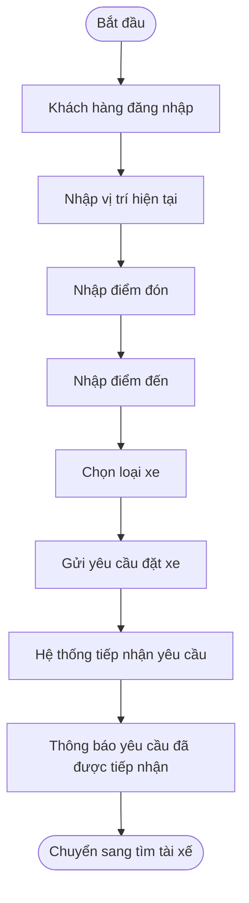
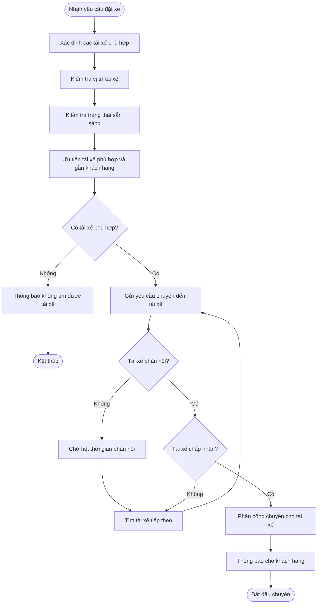
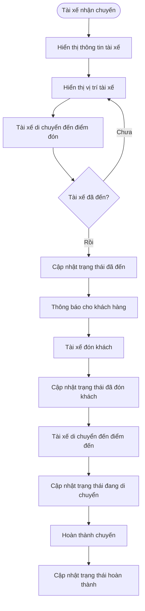

B1; xác định bussines contact( ngữ cảnh nghiệp vụ) và bussines problem 
Gợi ý:
Khách hàng muốn giải quyết vấn đề gì?
Vì sao hệ thống hiện tại k thể đáp ứng
Mục tiêu kinh doanh của họ là gì?
Ai sẽ sử dụng hệ thống này?
Giá thị hệ thống này tạo ra so với hệ thống cũ như thế nào?

# B1. Xác định Business Context và Business Problem

## 1. Business Context – Bối cảnh nghiệp vụ

Công ty ABC đang cung cấp dịch vụ đặt xe trực tuyến thông qua tổng đài và một ứng dụng đơn giản. Tuy nhiên, doanh nghiệp đang có nhu cầu xây dựng **CAB System** mới để tự động hóa và quản lý tập trung toàn bộ quy trình đặt xe, từ khi khách hàng yêu cầu xe, tìm và phân công tài xế, thực hiện chuyến, thanh toán đến đánh giá sau chuyến.

**Đối tượng sử dụng chính:**
- Khách hàng
- Tài xế
- Nhân viên vận hành

Hệ thống cũng cần tích hợp với **cổng thanh toán điện tử và dịch vụ thông báo** bên ngoài.

## 2. Business Problem – Vấn đề nghiệp vụ

Hệ thống hiện tại tồn tại các vấn đề:

- Phân công tài xế còn **thủ công**, mất thời gian và khó tối ưu.
- Khách hàng **khó theo dõi trạng thái chuyến đi**.
- Thanh toán và giao dịch **chưa được quản lý tập trung**.
- Nhân viên vận hành gặp khó khăn trong việc **quản lý khách hàng, tài xế, chuyến đi và xử lý sự cố**.
- Khó tổng hợp dữ liệu để theo dõi **doanh thu, số chuyến, tỷ lệ hoàn thành và tỷ lệ hủy**.
- Hệ thống **khó mở rộng** khi số lượng khách hàng và tài xế tăng.

## 3. Mục tiêu kinh doanh

- Tự động hóa quy trình đặt xe và phân công tài xế.
- Nâng cao trải nghiệm và khả năng theo dõi chuyến của khách hàng.
- Quản lý tập trung chuyến đi, thanh toán và dữ liệu vận hành.
- Giảm thao tác thủ công và nâng cao hiệu quả của nhân viên.
- Xây dựng hệ thống **ổn định, bảo mật và có khả năng mở rộng**.

## 4. Giá trị của hệ thống mới

So với hệ thống cũ, CAB System giúp **tự động hóa việc tìm tài xế, theo dõi chuyến, thanh toán và thông báo**, đồng thời cung cấp dữ liệu phục vụ quản lý và báo cáo.

Hệ thống giúp **giảm thời gian xử lý, nâng cao chất lượng dịch vụ, tăng hiệu quả vận hành và tạo nền tảng để doanh nghiệp mở rộng trong tương lai**.

# B2. Xác định các bên liên quan (Stakeholders)
1.	Những stalkholder - 	Vai trò là gì 
2.	Vẽ ma trận stalkholder matrick
## 1. Những stalkholder - 	Vai trò là gì 

| Stakeholder | Vai trò |
|---|---|
| Khách hàng | Đăng ký, đặt xe, theo dõi chuyến, thanh toán và đánh giá tài xế. |
| Tài xế | Nhận chuyến, chấp nhận/từ chối chuyến, thực hiện chuyến và cập nhật trạng thái. |
| Nhân viên vận hành | Quản lý khách hàng, tài xế, phương tiện, chuyến đi và xử lý sự cố. |
| Ban giám đốc | Xác định mục tiêu kinh doanh, theo dõi doanh thu và hiệu quả hoạt động. |
| Bộ phận kế toán/tài chính | Theo dõi giao dịch, thanh toán và doanh thu. |
| Nhà cung cấp thanh toán | Xử lý các giao dịch thanh toán điện tử. |
| Nhà cung cấp thông báo | Cung cấp dịch vụ gửi thông báo như SMS, Email hoặc các kênh khác. |
| Business Analyst (BA) | Thu thập, phân tích và làm rõ yêu cầu của các bên liên quan. |
| Đội phát triển hệ thống | Thiết kế, xây dựng, kiểm thử và triển khai hệ thống. |

2.	Vẽ ma trận stalkholder matrick
## 3. Stakeholder Matrix

| MỨC ĐỘ ẢNH HƯỞNG | MỨC ĐỘ QUAN TÂM THẤP | MỨC ĐỘ QUAN TÂM CAO |
|---|---|---|
| **CAO** | Nhà cung cấp thanh toán<br>Nhà cung cấp thông báo | Ban lãnh đạo<br>Nhân viên vận hành |
| **THẤP** | BA / Đội phát triển | Khách hàng<br>Tài xế |

### Sơ đồ Stakeholder Matrix

                    MỨC ĐỘ ẢNH HƯỞNG
                            CAO
                             │
                             │
       Nhà cung cấp         │        Ban lãnh đạo
       thanh toán &         │        Nhân viên vận hành
       thông báo            │
                             │
       ──────────────────────┼──────────────────────
                             │
       BA / Đội phát triển   │        Khách hàng
                             │        Tài xế
                             │
                             │
                            THẤP
                     MỨC ĐỘ QUAN TÂM
                       THẤP       CAO

# B3. BUSINESS GOALS

## BJ01 – HỖ TRỢ THANH TOÁN

Hỗ trợ nhiều hình thức thanh toán nhằm đáp ứng nhu cầu thanh toán của khách hàng.

## BJ02 – GIẢM THỜI GIAN TÌM TÀI XẾ

Rút ngắn thời gian từ khi khách hàng đặt xe đến khi tìm được tài xế phù hợp.

## BJ03 – NÂNG CAO TRẢI NGHIỆM KHÁCH HÀNG

Giúp khách hàng dễ dàng đặt xe, theo dõi chuyến đi và nắm được thông tin chuyến đi.

## BJ04 – NÂNG CAO HIỆU QUẢ HOẠT ĐỘNG TÀI XẾ

Giúp doanh nghiệp quản lý trạng thái, thông tin và hoạt động của tài xế hiệu quả hơn.

## BJ05 – GIẢM TỶ LỆ CHUYẾN ĐI BỊ HỦY

Hạn chế các trường hợp chuyến đi bị hủy do không tìm được tài xế hoặc tài xế không phản hồi.

## BJ06 – NÂNG CAO KHẢ NĂNG THEO DÕI CHUYẾN ĐI

Cho phép doanh nghiệp và khách hàng nắm được trạng thái của chuyến đi trong quá trình thực hiện.

## BJ07 – TẬP TRUNG QUẢN LÝ DỮ LIỆU

Tập trung thông tin khách hàng, tài xế, phương tiện, chuyến đi và giao dịch trên một hệ thống.

## BJ08 – NÂNG CAO HIỆU QUẢ QUẢN LÝ VẬN HÀNH

Giúp nhân viên vận hành theo dõi và xử lý các chuyến đi, tài xế và sự cố hiệu quả hơn.

## BJ09 – NÂNG CAO ĐỘ TIN CẬY CỦA HỆ THỐNG

Đảm bảo các chức năng quan trọng của hệ thống tiếp tục hoạt động khi một thành phần gặp sự cố.

## BJ10 – ĐẢM BẢO AN TOÀN THÔNG TIN

Bảo vệ thông tin cá nhân, thông tin phương tiện, dữ liệu vị trí và dữ liệu giao dịch của người dùng.

## BJ11 – NÂNG CAO KHẢ NĂNG MỞ RỘNG

Cho phép hệ thống đáp ứng số lượng khách hàng và tài xế ngày càng tăng.

## BJ12 – HỖ TRỢ PHÁT TRIỂN DỊCH VỤ MỚI

Tạo khả năng bổ sung các loại dịch vụ và phương thức thanh toán mới trong tương lai.

## BJ13 – NÂNG CAO HIỆU QUẢ THANH TOÁN

Giảm các vấn đề phát sinh trong quá trình thanh toán và hỗ trợ xử lý khi giao dịch thất bại.

## BJ14 – CẢI THIỆN CHẤT LƯỢNG DỊCH VỤ

Thu thập đánh giá sau chuyến đi để doanh nghiệp có cơ sở theo dõi và cải thiện chất lượng dịch vụ.

## BJ15 – HỖ TRỢ RA QUYẾT ĐỊNH KINH DOANH

Cung cấp dữ liệu và báo cáo về số lượng chuyến, doanh thu, tỷ lệ hoàn thành, tỷ lệ hủy và hiệu quả hoạt động của tài xế.
#B3: BUSINESS GOALS
## BJ01 – Tăng tính linh hoạt và thuận tiện trong thanh toán:
* Hỗ trợ thanh toán bằng tiền mặt.
* Hỗ trợ thanh toán online/chuyển khoản.
--
## BJ02 – Giảm thời gian chờ xe của khách hàng:
* Tìm tài xế tự động.
* Ưu tiên tài xế phù hợp và gần khách hàng.
---
## BJ03 – Nâng cao trải nghiệm đặt xe của khách hàng:
* Dễ dàng tạo yêu cầu đặt xe.
* Biết được trạng thái của yêu cầu đặt xe.
* Biết thông tin tài xế khi chuyến xe được xác nhận.
* Theo dõi được tình trạng chuyến đi.
---
## BJ04 – Nâng cao hiệu quả quản lý và vận hành:
* Theo dõi được các chuyến xe đang diễn ra.
* Nắm được tình trạng hoạt động của tài xế.
* Hỗ trợ xử lý các trường hợp chuyến xe gặp vấn đề.
* Tra cứu được thông tin các giao dịch và chuyến đi.
---
## BJ05 – Nâng cao hiệu quả hoạt động của tài xế
* Nắm được trạng thái hoạt động của tài xế.
* Phân công chuyến xe cho tài xế phù hợp.
* Ưu tiên tài xế có vị trí thuận lợi cho khách hàng.
* Hạn chế thời gian tài xế phải chờ nhận chuyến.
---
## BJ06 – Nâng cao khả năng theo dõi và minh bạch thông tin chuyến đi
* Biết tài xế nào đang thực hiện chuyến.
* Biết thời gian dự kiến tài xế đến.
* Biết trạng thái hiện tại của chuyến xe.
* Tra cứu được lịch sử chuyến đi.
---
## BJ07 – Nâng cao độ tin cậy của dịch vụ đặt xe
* Không làm gián đoạn toàn bộ dịch vụ khi thanh toán gặp lỗi.
* Không làm gián đoạn toàn bộ dịch vụ khi thông báo gặp lỗi.
* Có phương án xử lý khi không tìm được tài xế.
* Có phương án xử lý khi tài xế không phản hồi hoặc từ chối chuyến.
---
## BJ08 – Nâng cao chất lượng thanh toán
* Hỗ trợ nhiều phương thức thanh toán.
* Thông báo rõ kết quả thanh toán.
* Có khả năng xử lý lại khi thanh toán điện tử thất bại.
* Bảo vệ thông tin thanh toán nhạy cảm của khách hàng.
---
## BJ09 – Nâng cao chất lượng dịch vụ thông qua phản hồi khách hàng
* Đánh giá tài xế sau khi hoàn thành chuyến.
* Ghi nhận kết quả đánh giá của khách hàng.
* Sử dụng thông tin đánh giá để theo dõi chất lượng tài xế.
---
## BJ10 – Nâng cao khả năng mở rộng của hệ thống
* Hệ thống có thể phục vụ số lượng lớn khách hàng và tài xế.
* Có thể mở rộng từng thành phần khi nhu cầu tăng.
* Có thể bổ sung các dịch vụ mới trong tương lai.
---

## BJ11 – Tăng khả năng phát triển và thay đổi hệ thống
* Có thể thêm phương thức thanh toán mới.
* Có thể thêm nhà cung cấp thông báo mới.
* Có thể bổ sung các loại dịch vụ mới.
* Có thể thay đổi một số thành phần kỹ thuật khi cần thiết.
---
## BJ12 – Nâng cao khả năng kiểm soát và bảo mật thông tin
* Bảo vệ thông tin cá nhân của khách hàng và tài xế.
* Bảo vệ dữ liệu vị trí.
* Bảo vệ dữ liệu giao dịch.
* Kiểm soát quyền truy cập của nhân viên.
* Lưu lại các thao tác quan trọng để phục vụ kiểm tra.

#B4: Xác định PHẠM VI SCOPE: 
1. Quản lý tài khoản người dùng
- Đăng ký và đăng nhập tài khoản khách hàng.
- Quản lý thông tin cá nhân khách hàng.
- Quản lý tài khoản và hồ sơ tài xế.
- Quản lý quyền truy cập của nhân viên vận hành và quản trị viên.
2. Quản lý tài xế và phương tiện
- Quản lý thông tin tài xế.
- Quản lý thông tin phương tiện.
- Theo dõi trạng thái hoạt động của tài xế.
- Theo dõi vị trí của tài xế.
- Quản lý khả năng nhận chuyến của tài xế.
3. Đặt xe và phân công tài xế
- Nhập điểm đón và điểm đến.
- Lựa chọn loại xe.
- Tiếp nhận yêu cầu đặt xe.
- Tìm kiếm tài xế phù hợp.
- Ưu tiên tài xế dựa trên vị trí, trạng thái và tiêu chí vận hành.
- Tiếp tục tìm tài xế khác khi tài xế từ chối hoặc không phản hồi.
- Thông báo khi không tìm được tài xế.
4. Quản lý chuyến đi
- Theo dõi trạng thái chuyến đi.
- Cập nhật trạng thái chuyến.
- Theo dõi thời gian dự kiến tài xế đến.
- Quản lý quá trình thực hiện chuyến.
- Xử lý các trường hợp chuyến bị hủy hoặc gặp sự cố.
- Lưu lịch sử chuyến đi.
5. Tính cước và thanh toán
- Xác định số tiền khách hàng phải trả.
- Hỗ trợ thanh toán bằng tiền mặt.
- Hỗ trợ thanh toán điện tử/chuyển khoản.
- Tích hợp với nhà cung cấp thanh toán bên ngoài.
- Xử lý kết quả thanh toán.
- Xử lý trường hợp thanh toán thất bại.
- Lưu lịch sử giao dịch.
- Không lưu trực tiếp thông tin nhạy cảm của thẻ hoặc tài khoản thanh toán.
6. Thông báo
- Thông báo cho khách hàng về trạng thái đặt xe.
- Thông báo khi tài xế nhận chuyến.
- Thông báo khi tài xế đến điểm đón.
- Thông báo khi chuyến hoàn thành.
- Thông báo kết quả thanh toán.
- Thông báo cho tài xế về chuyến mới và các thay đổi liên quan đến chuyến đi.
- Hỗ trợ mở rộng thêm các kênh thông báo trong tương lai.
7. Đánh giá và phản hồi
- Khách hàng đánh giá tài xế sau khi hoàn thành chuyến.
- Lưu thông tin đánh giá.
- Theo dõi chất lượng phục vụ của tài xế.
8. Quản trị và vận hành
- Quản lý khách hàng.
- Quản lý tài xế.
- Quản lý phương tiện.
- Theo dõi các chuyến đang diễn ra.
- Kiểm tra trạng thái tài xế.
- Hỗ trợ xử lý các chuyến bị lỗi.
- Tra cứu lịch sử giao dịch.
- Phân quyền các thao tác quản trị.
9. Báo cáo
- Báo cáo số lượng chuyến.
- Báo cáo doanh thu.
- Báo cáo tỷ lệ chuyến hoàn thành.
- Báo cáo tỷ lệ hủy chuyến.
- Báo cáo hiệu quả hoạt động của tài xế.
10. Bảo mật và kiểm soát
- Xác thực người dùng.
- Phân quyền truy cập.
- Bảo vệ thông tin cá nhân.
- Bảo vệ dữ liệu phương tiện.
- Bảo vệ dữ liệu vị trí.
- Bảo vệ dữ liệu giao dịch.
- Lưu vết các thao tác quan trọng.

# B5. Business Requirements:

| Mã | Tên | Diễn giải |
|---|---|---|
| BR01 | Đặt chuyến xe | Hệ thống cho phép khách hàng đặt chuyến bằng cách xác định vị trí hiện tại, điểm đón, điểm đến và lựa chọn loại xe phù hợp. |
| BR02 | Tìm và phân công tài xế | Hệ thống cho phép tìm và lựa chọn tài xế phù hợp với chuyến đi dựa trên vị trí, trạng thái sẵn sàng và các tiêu chí vận hành. |
| BR03 | Theo dõi chuyến đi | Hệ thống cho phép khách hàng theo dõi trạng thái chuyến đi trong suốt quá trình di chuyển. |
| BR04 | Quản lý tài xế | Hệ thống cho phép doanh nghiệp quản lý thông tin tài xế, phương tiện và trạng thái hoạt động của tài xế. |
| BR05 | Quản lý chuyến đi | Hệ thống cho phép quản lý và cập nhật trạng thái chuyến đi từ khi tạo yêu cầu đến khi hoàn thành hoặc hủy chuyến. |
| BR06 | Tính cước | Hệ thống cho phép xác định số tiền khách hàng phải trả dựa trên loại dịch vụ và thông tin chuyến đi. |
| BR07 | Thanh toán | Hệ thống cho phép khách hàng thanh toán bằng tiền mặt hoặc phương thức thanh toán điện tử thông qua nhà cung cấp thanh toán bên ngoài. |
| BR08 | Thông báo | Hệ thống cung cấp thông báo cho khách hàng và tài xế về các sự kiện quan trọng trong quá trình đặt và thực hiện chuyến. |
| BR09 | Đánh giá tài xế | Hệ thống cho phép khách hàng đánh giá tài xế sau khi chuyến đi hoàn thành. |
| BR10 | Quản lý vận hành | Hệ thống cung cấp giao diện để nhân viên vận hành quản lý khách hàng, tài xế, phương tiện, chuyến đi và giao dịch. |
| BR11 | Báo cáo hoạt động | Hệ thống cung cấp báo cáo về số lượng chuyến, doanh thu, tỷ lệ hoàn thành, tỷ lệ hủy và hiệu quả hoạt động của tài xế. |
| BR12 | Bảo mật và phân quyền | Hệ thống đảm bảo người dùng được xác thực, phân quyền phù hợp và bảo vệ thông tin cá nhân, dữ liệu vị trí và giao dịch. |

#B6.  Business Process:

# Business Process – CAB System

 1. Quy trình đặt chuyến xe – BR01


2. Quy trình tìm và phân công tài xế – BR02

3. Quy trình theo dõi chuyến đi – BR03

4. Quy trình quản lý tài xế – BR04
   ```mermaid
   flowchart TD
    A([Nhân viên vận hành]) --> B[Đăng ký hoặc tạo tài khoản tài xế]
    B --> C[Nhập thông tin tài xế]
    C --> D[Nhập thông tin phương tiện]
    D --> E[Kiểm tra thông tin]
    E --> F{Thông tin hợp lệ?}

    F -- Không --> G[Yêu cầu cập nhật thông tin]
    G --> C

    F -- Có --> H[Tạo hồ sơ tài xế]
    H --> I[Tài xế đăng nhập]
    I --> J[Cập nhật trạng thái hoạt động]
    J --> K{Sẵn sàng nhận chuyến?}

    K -- Có --> L[Đưa tài xế vào danh sách có thể nhận chuyến]
    K -- Không --> M[Không phân công chuyến]
   ```
5. Quy trình quản lý chuyến đi – BR05
   ```mermaid
    flowchart TD
    A([Tạo yêu cầu]) --> B[Chờ tìm tài xế]
    B --> C{Đã có tài xế?}

    C -- Không --> D[Tiếp tục tìm tài xế]
    D --> C

    C -- Có --> E[Đã phân công tài xế]
    E --> F[Tài xế đang đến]
    F --> G[Đã đến điểm đón]
    G --> H[Đã đón khách]
    H --> I[Đang di chuyển]
    I --> J[Hoàn thành chuyến]

    B --> K{Khách hàng hủy?}
    K -- Có --> L[Hủy chuyến]
    K -- Không --> C

    L --> M[Lưu thông tin hủy chuyến]
    J --> N[Lưu thông tin chuyến]
    ```
6. Quy trình tính cước – BR06
   ```mermaid
   flowchart TD
    A([Chuyến hoàn thành]) --> B[Lấy thông tin chuyến]
    B --> C[Xác định loại dịch vụ]
    C --> D[Xác định thông tin quãng đường và chuyến đi]
    D --> E[Áp dụng quy tắc tính cước]
    E --> F[Tính tổng tiền]
    F --> G[Lưu thông tin cước]
    G --> H[Thông báo số tiền phải trả cho khách hàng]
    H --> I([Chuyển sang thanh toán])
   ```
7. Quy trình thanh toán – BR07
   ```mermaid
   flowchart TD
    A([Nhận số tiền phải trả]) --> B{Chọn phương thức thanh toán}

    B -- Tiền mặt --> C[Khách hàng thanh toán tiền mặt]
    C --> D[Xác nhận thanh toán]
    D --> E[Lưu giao dịch]

    B -- Thanh toán điện tử --> F[Gửi yêu cầu đến nhà cung cấp thanh toán]
    F --> G{Thanh toán thành công?}

    G -- Có --> H[Nhận kết quả giao dịch]
    H --> E

    G -- Không --> I[Thông báo thanh toán thất bại]
    I --> J{Khách hàng muốn thanh toán lại?}

    J -- Có --> F
    J -- Không --> K[Lưu giao dịch thất bại]

    E --> L[Thông báo kết quả thanh toán]
    K --> L
   ```
8. Quy trình thông báo – BR08
    ```mermaid
    flowchart TD
    A([Có sự kiện trong hệ thống]) --> B{Loại sự kiện}

    B -- Đặt xe --> C[Thông báo yêu cầu đã được tiếp nhận]
    B -- Tài xế nhận chuyến --> D[Thông báo tài xế đã nhận chuyến]
    B -- Tài xế đến --> E[Thông báo tài xế đã đến]
    B -- Hoàn thành chuyến --> F[Thông báo chuyến đã hoàn thành]
    B -- Thanh toán --> G[Thông báo kết quả thanh toán]
    B -- Chuyến mới --> H[Thông báo cho tài xế]

    C --> I[Gửi thông báo]
    D --> I
    E --> I
    F --> I
    G --> I
    H --> I

    I --> J([Kết thúc])
    ```
9. Quy trình đánh giá tài xế – BR09
    ```mermaid
    flowchart TD
    A([Chuyến hoàn thành]) --> B[Hiển thị yêu cầu đánh giá]
    B --> C[Khách hàng đánh giá tài xế]
    C --> D[Nhập điểm đánh giá]
    D --> E[Nhập nhận xét nếu có]
    E --> F[Gửi đánh giá]
    F --> G[Lưu đánh giá]
    G --> H[Cập nhật dữ liệu đánh giá tài xế]
    H --> I([Kết thúc])
    ```
10. Quy trình quản lý vận hành – BR10\
    ```mermaid
    flowchart TD
    A([Nhân viên vận hành đăng nhập]) --> B[Xác thực tài khoản]
    B --> C{Có quyền truy cập?}

    C -- Không --> D[Từ chối truy cập]
    D --> E([Kết thúc])

    C -- Có --> F[Truy cập giao diện quản trị]
    F --> G{Chọn chức năng}

    G -- Quản lý khách hàng --> H[Thêm/Sửa/Xem khách hàng]
    G -- Quản lý tài xế --> I[Thêm/Sửa/Xem tài xế]
    G -- Quản lý phương tiện --> J[Thêm/Sửa/Xem phương tiện]
    G -- Quản lý chuyến --> K[Xem và xử lý chuyến]
    G -- Quản lý giao dịch --> L[Tra cứu giao dịch]

    H --> M[Lưu thay đổi]
    I --> M
    J --> M
    K --> M
    L --> M

    M --> N([Kết thúc])
    ```
11. Quy trình báo cáo hoạt động – BR11
    ```mermaid
    flowchart TD
    A([Nhân viên/Quản lý yêu cầu báo cáo]) --> B[Chọn khoảng thời gian]
    B --> C[Hệ thống lấy dữ liệu]
    C --> D[Tổng hợp số lượng chuyến]
    D --> E[Tổng hợp doanh thu]
    E --> F[Tính tỷ lệ hoàn thành]
    F --> G[Tính tỷ lệ hủy]
    G --> H[Phân tích hiệu quả tài xế]
    H --> I[Hiển thị báo cáo]
    I --> J([Kết thúc])
    ```
12. Quy trình bảo mật và phân quyền – BR12
     ```mermaid
     flowchart TD
    A([Người dùng truy cập hệ thống]) --> B[Nhập thông tin đăng nhập]
    B --> C[Xác thực tài khoản]
    C --> D{Thông tin hợp lệ?}

    D -- Không --> E[Thông báo đăng nhập thất bại]
    E --> F([Kết thúc])

    D -- Có --> G[Xác định vai trò người dùng]
    G --> H[Kiểm tra quyền truy cập]
    H --> I{Có quyền thực hiện?}

    I -- Không --> J[Từ chối thao tác]
    J --> K[Ghi nhận log]
    K --> L([Kết thúc])

    I -- Có --> M[Cho phép thực hiện chức năng]
    M --> N[Ghi nhận thao tác quan trọng]
    N --> O[Bảo vệ dữ liệu]
    O --> P([Kết thúc])
     ````

##B7. Phân rã: 
| FR       | Chức năng         | Mô tả                                                                    |
| -------- | ----------------- | ------------------------------------------------------------------------ |
| **FR01** | Quản lý tài khoản | Đăng ký, đăng nhập và cập nhật thông tin người dùng.                     |
| **FR02** | Đặt xe            | Nhập điểm đón, điểm đến và chọn loại xe để gửi yêu cầu.                  |
| **FR03** | Tìm tài xế        | Xác định và ưu tiên tài xế phù hợp, gần khách hàng.                      |
| **FR04** | Phân công tài xế  | Gửi yêu cầu cho tài xế và tìm tài xế khác nếu bị từ chối.                |
| **FR05** | Quản lý chuyến đi | Theo dõi và cập nhật trạng thái chuyến đi.                               |
| **FR06** | Theo dõi vị trí   | Lưu và cập nhật vị trí tài xế để hỗ trợ tìm xe và dự kiến thời gian đến. |
| **FR07** | Tính cước         | Tính số tiền khách hàng phải trả dựa trên thông tin chuyến đi.           |
| **FR08** | Thanh toán        | Hỗ trợ thanh toán tiền mặt và thanh toán điện tử.                        |
| **FR09** | Thông báo         | Gửi thông báo về đặt xe, tài xế, chuyến đi và thanh toán.                |
| **FR10** | Đánh giá tài xế   | Cho phép khách hàng đánh giá tài xế sau khi hoàn thành chuyến.           |
| **FR11** | Quản lý vận hành  | Quản lý khách hàng, tài xế, phương tiện và chuyến đi.                    |
| **FR12** | Báo cáo           | Cung cấp báo cáo về chuyến đi, doanh thu, tỷ lệ hủy và hiệu quả tài xế.  |
| **FR13** | Phân quyền        | Kiểm soát quyền truy cập các chức năng quản trị.                         |
| **FR14** | Quản lý lịch sử   | Tra cứu lịch sử chuyến đi và giao dịch.                                  |
##B8.# B8: Business Goal and Acceptance Criteria

| ID       | Business Goal                                | Acceptance Criteria                                                                                                                                                                                                                                                                                    |
| -------- | -------------------------------------------- | ------------------------------------------------------------------------------------------------------------------------------------------------------------------------------------------------------------------------------------------------------------------------------------------------------ |
| **BG01** | **Ưu tiên tài xế phù hợp**                   | • Ưu tiên tài xế đang sẵn sàng nhận chuyến.<br>• Ưu tiên tài xế có vị trí gần khách hàng.<br>• Có thể xem xét thêm ranking/đánh giá tài xế.<br>• Không đề xuất tài xế đang bận hoặc không sẵn sàng.                                                                                                    |
| **BG02** | **Giảm thời gian tìm tài xế**                | • Hệ thống tự động tìm tài xế sau khi khách hàng đặt xe.<br>• Gửi yêu cầu đến tài xế phù hợp.<br>• Tài xế không phản hồi trong thời gian quy định được xem là không nhận chuyến.<br>• Hệ thống tiếp tục tìm tài xế khác.                                                                               |
| **BG03** | **Xử lý tài xế từ chối hoặc không phản hồi** | • Nếu tài xế từ chối, hệ thống tìm tài xế khác.<br>• Nếu tài xế không phản hồi, hệ thống chuyển sang tài xế khác.<br>• Không gửi lại yêu cầu cho tài xế đã từ chối cùng chuyến.<br>• Khách hàng không cần tạo lại yêu cầu.                                                                             |
| **BG04** | **Xử lý khi không tìm được tài xế**          | • Nếu khu vực không có tài xế phù hợp, hệ thống thông báo cho khách hàng.<br>• Không để yêu cầu ở trạng thái “đang tìm tài xế” vô thời hạn.<br>• Lưu trạng thái không tìm được tài xế.<br>• Khách hàng có thể thực hiện lại yêu cầu.                                                                   |
| **BG05** | **Theo dõi trạng thái chuyến đi**            | • Khách hàng biết tài xế đã nhận chuyến.<br>• Cập nhật khi tài xế đến điểm đón.<br>• Cập nhật khi đã đón khách.<br>• Cập nhật khi đang di chuyển.<br>• Cập nhật khi chuyến hoàn thành.                                                                                                                 |
| **BG06** | **Đảm bảo thanh toán thành công**            | • Xác định số tiền phải thanh toán sau khi chuyến hoàn thành.<br>• Hỗ trợ nhiều phương thức thanh toán.<br>• Ghi nhận giao dịch khi thanh toán thành công.<br>• Thông báo kết quả thanh toán cho khách hàng.                                                                                           |
| **BG07** | **Xử lý thanh toán thất bại**                | • Thông báo cho khách hàng khi thanh toán thất bại.<br>• Ghi nhận giao dịch ở trạng thái thất bại.<br>• Cho phép thanh toán lại theo chính sách doanh nghiệp.<br>• Lỗi thanh toán không làm toàn bộ hệ thống đặt xe ngừng hoạt động.<br>• Không lưu thông tin thẻ nhạy cảm.                            |
| **BG08** | **Hỗ trợ thanh toán tiền mặt**               | • Khách hàng có thể chọn tiền mặt.<br>• Ghi nhận số tiền cần thanh toán.<br>• Ghi nhận kết quả thanh toán theo quy định.<br>• Lưu lịch sử giao dịch.                                                                                                                                                   |
| **BG09** | **Đảm bảo thông báo kịp thời**               | • Thông báo khi yêu cầu được tiếp nhận.<br>• Thông báo khi tài xế nhận chuyến.<br>• Thông báo khi tài xế đến điểm đón.<br>• Thông báo khi chuyến hoàn thành.<br>• Thông báo kết quả thanh toán.<br>• Tài xế nhận thông báo khi có chuyến mới.                                                          |
| **BG10** | **Xử lý hủy chuyến**                         | • Khách hàng chỉ được hủy theo chính sách doanh nghiệp.<br>• Cập nhật trạng thái chuyến thành “Đã hủy”.<br>• Thông báo cho tài xế khi chuyến bị hủy.<br>• Xác định phí hủy nếu có.<br>• Lưu lịch sử hủy chuyến.                                                                                        |
| **BG11** | **Đảm bảo bảo mật và phân quyền**            | • Người dùng phải xác thực trước khi sử dụng chức năng yêu cầu tài khoản.<br>• Nhân viên chỉ được thực hiện thao tác theo quyền được cấp.<br>• Ngăn người không có quyền thực hiện thao tác quản trị nhạy cảm.<br>• Lưu vết các thao tác quan trọng.<br>• Bảo vệ dữ liệu cá nhân, vị trí và giao dịch. |
| **BG12** | **Xử lý mất kết nối mạng**                   | • Không hủy chuyến ngay khi tài xế mất kết nối tạm thời.<br>• Ghi nhận thời điểm mất kết nối.<br>• Đồng bộ lại trạng thái khi tài xế kết nối lại.<br>• Xử lý theo chính sách nếu mất kết nối quá lâu.<br>• Thông báo cho khách hàng nếu ảnh hưởng đến chuyến.                                          |
| **BG13** | **Nâng cao chất lượng dịch vụ**              | • Khách hàng được đánh giá sau khi chuyến hoàn thành.<br>• Không cho phép đánh giá chuyến chưa hoàn thành.<br>• Lưu kết quả đánh giá.<br>• Sử dụng dữ liệu đánh giá để theo dõi chất lượng tài xế.                                                                                                     |
| **BG14** | **Hỗ trợ báo cáo hoạt động**                 | • Có thông tin số lượng chuyến.<br>• Có thông tin doanh thu.<br>• Có tỷ lệ chuyến hoàn thành.<br>• Có tỷ lệ chuyến hủy.<br>• Có thông tin hiệu quả hoạt động của tài xế.                                                                                                                               |

##B9. Mô hình hóa hệ thống – Mô hình dữ liệu

 9.1. Xác định các thực thể và thuộc tính

| Thực thể | Thuộc tính |
|---|---|
| **Khách hàng (Customer)** | CustomerID, FullName, Email, Phone, Password, Address, CreatedAt, Status |
| **Tài xế (Driver)** | DriverID, FullName, Email, Phone, Password, LicenseNumber, Status, CurrentLocation, CreatedAt |
| **Phương tiện (Vehicle)** | VehicleID, DriverID, VehicleType, LicensePlate, Brand, Model, Color, Status |
| **Chuyến đi (Trip)** | TripID, CustomerID, DriverID, VehicleID, PickupLocation, Destination, Distance, StartTime, EndTime, Status, Fare |
| **Yêu cầu đặt xe (Booking)** | BookingID, CustomerID, PickupLocation, Destination, VehicleType, BookingTime, Status |
| **Thanh toán (Payment)** | PaymentID, TripID, PaymentMethod, Amount, PaymentTime, PaymentStatus, TransactionCode |
| **Đánh giá (Rating)** | RatingID, TripID, CustomerID, DriverID, RatingScore, Comment, CreatedAt |
| **Thông báo (Notification)** | NotificationID, UserID, Title, Content, NotificationType, SentAt, Status |
| **Nhân viên vận hành (Staff)** | StaffID, FullName, Email, Phone, Password, Role, Status |
| **Giao dịch/Log hệ thống (AuditLog)** | LogID, UserID, Action, Description, CreatedAt, IPAddress |

 9.2. Mô tả một số thực thể chính

### Customer – Khách hàng

- **CustomerID:** Mã khách hàng.
- **FullName:** Họ và tên.
- **Email:** Email đăng nhập.
- **Phone:** Số điện thoại.
- **Password:** Mật khẩu tài khoản.
- **Address:** Địa chỉ.
- **CreatedAt:** Ngày tạo tài khoản.
- **Status:** Trạng thái tài khoản.

### Driver – Tài xế

- **DriverID:** Mã tài xế.
- **FullName:** Họ và tên.
- **Email:** Email.
- **Phone:** Số điện thoại.
- **Password:** Mật khẩu.
- **LicenseNumber:** Số giấy phép lái xe.
- **Status:** Trạng thái hoạt động.
- **CurrentLocation:** Vị trí hiện tại.
- **CreatedAt:** Ngày tạo tài khoản.

### Vehicle – Phương tiện

- **VehicleID:** Mã phương tiện.
- **DriverID:** Mã tài xế.
- **VehicleType:** Loại xe.
- **LicensePlate:** Biển số xe.
- **Brand:** Hãng xe.
- **Model:** Mẫu xe.
- **Color:** Màu xe.
- **Status:** Trạng thái phương tiện.

### Trip – Chuyến đi

- **TripID:** Mã chuyến.
- **CustomerID:** Mã khách hàng.
- **DriverID:** Mã tài xế.
- **VehicleID:** Mã phương tiện.
- **PickupLocation:** Điểm đón.
- **Destination:** Điểm đến.
- **Distance:** Quãng đường.
- **StartTime:** Thời gian bắt đầu.
- **EndTime:** Thời gian kết thúc.
- **Status:** Trạng thái chuyến.
- **Fare:** Cước phí.

### Payment – Thanh toán

- **PaymentID:** Mã thanh toán.
- **TripID:** Mã chuyến.
- **PaymentMethod:** Phương thức thanh toán.
- **Amount:** Số tiền.
- **PaymentTime:** Thời gian thanh toán.
- **PaymentStatus:** Trạng thái thanh toán.
- **TransactionCode:** Mã giao dịch.

 9.3. Quan hệ giữa các thực thể

- **Customer 1 - N Booking:** Một khách hàng có thể tạo nhiều yêu cầu đặt xe.
- **Customer 1 - N Trip:** Một khách hàng có thể thực hiện nhiều chuyến.
- **Driver 1 - N Trip:** Một tài xế có thể thực hiện nhiều chuyến.
- **Driver 1 - N Vehicle:** Một tài xế có thể có nhiều phương tiện.
- **Vehicle 1 - N Trip:** Một phương tiện có thể được sử dụng cho nhiều chuyến.
- **Trip 1 - 1 Payment:** Một chuyến có một giao dịch thanh toán.
- **Trip 1 - 1 Rating:** Một chuyến có thể có một đánh giá.
- **Customer 1 - N Rating:** Một khách hàng có thể tạo nhiều đánh giá.
- **Driver 1 - N Rating:** Một tài xế có thể nhận nhiều đánh giá.
- **User 1 - N Notification:** Một người dùng có thể nhận nhiều thông báo.
- **User 1 - N AuditLog:** Một người dùng có thể tạo nhiều log thao tác.

 9.4. Các thực thể cốt lõi của MVP

Trong phạm vi MVP 7 tuần, các thực thể quan trọng nhất là:

**Customer → Driver → Vehicle → Booking → Trip → Payment → Rating**
##B10. Xác định yêu cầu phi chức năng

| Mã | Nhóm yêu cầu | Yêu cầu |
|---|---|---|
| NBR-01 | Hiệu năng | Hệ thống phải phản hồi nhanh khi khách hàng đặt xe và không bị chậm đáng kể khi số lượng người dùng tăng cao. |
| NBR-02 | Khả năng mở rộng | Hệ thống phải có khả năng mở rộng khi số lượng khách hàng, tài xế và chuyến đi tăng. |
| NBR-03 | Tính sẵn sàng | Hệ thống phải hoạt động ổn định và hạn chế tối đa thời gian ngừng hoạt động. |
| NBR-04 | Độ tin cậy | Lỗi tại một thành phần như thanh toán hoặc thông báo không được làm toàn bộ hệ thống đặt xe ngừng hoạt động. |
| NBR-05 | Bảo mật | Hệ thống phải bảo vệ thông tin cá nhân, thông tin tài xế, dữ liệu vị trí và dữ liệu giao dịch. |
| NBR-06 | Xác thực và phân quyền | Hệ thống phải xác thực người dùng và kiểm soát quyền truy cập đối với các chức năng quản trị. |
| NBR-07 | Lưu vết | Hệ thống phải ghi nhận các thao tác quan trọng để phục vụ kiểm tra và xử lý sự cố. |
| NBR-08 | Khả năng bảo trì | Hệ thống phải được thiết kế theo hướng dễ bảo trì, sửa lỗi và nâng cấp. |
| NBR-09 | Khả năng tích hợp | Hệ thống phải có khả năng tích hợp với nhà cung cấp thanh toán và các dịch vụ thông báo bên ngoài. |
| NBR-10 | Khả năng mở rộng chức năng | Hệ thống phải cho phép bổ sung loại dịch vụ, phương thức thanh toán và kênh thông báo mới mà không phải xây dựng lại toàn bộ hệ thống. |
| NBR-11 | Tính linh hoạt | Các thành phần kỹ thuật có thể được thay đổi hoặc nâng cấp mà hạn chế ảnh hưởng đến các chức năng khác. |
| NBR-12 | Khả năng phục hồi | Hệ thống phải có khả năng xử lý và phục hồi khi xảy ra lỗi hoặc mất kết nối. |

Đây là nhóm thực thể phục vụ trực tiếp quy trình:

**Khách hàng → Đặt xe → Tìm tài xế → Thực hiện chuyến → Tính cước → Thanh toán → Đánh giá.**
